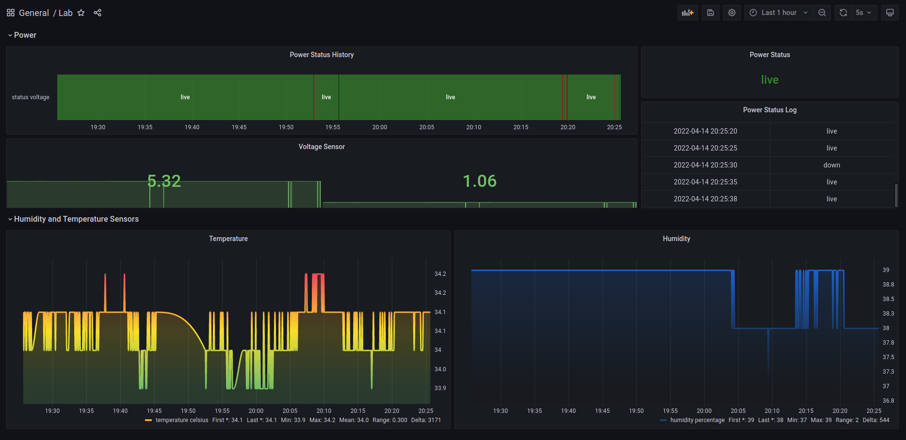

# UK Power Monitor

Monitors and tweets mains power status of the Uttarakhand state.

Functions: 
1. Monitors mains power and other stats. 
2. Stores metric in a Timeseries database.
3. Tweet power status (TODO)

# Grafana

[Grafana Dashboard Snapshot](https://snapshots.raintank.io/dashboard/snapshot/EjkITqt85gGjJwfb2tf07lsEDsm3M5hs)
